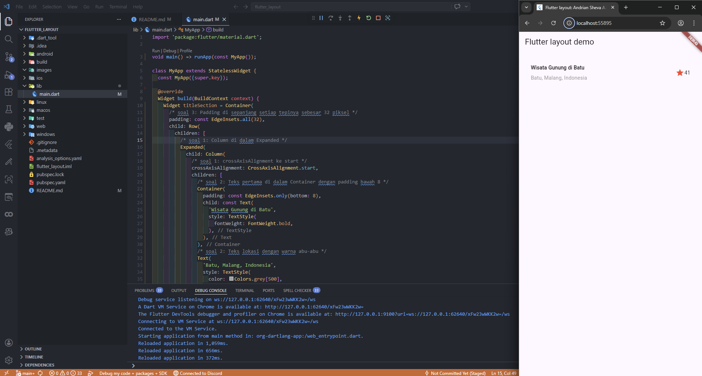
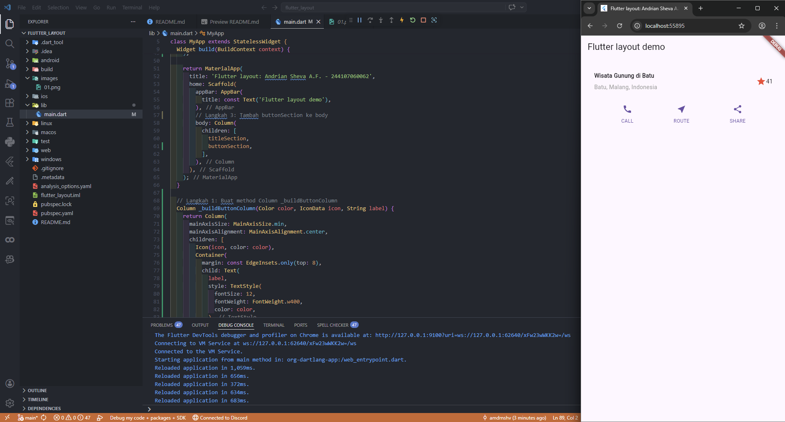
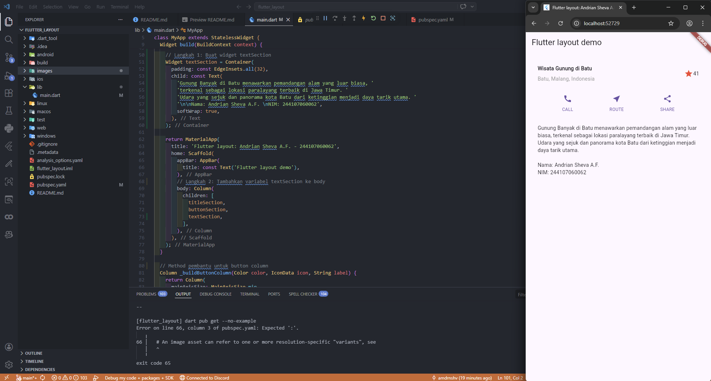
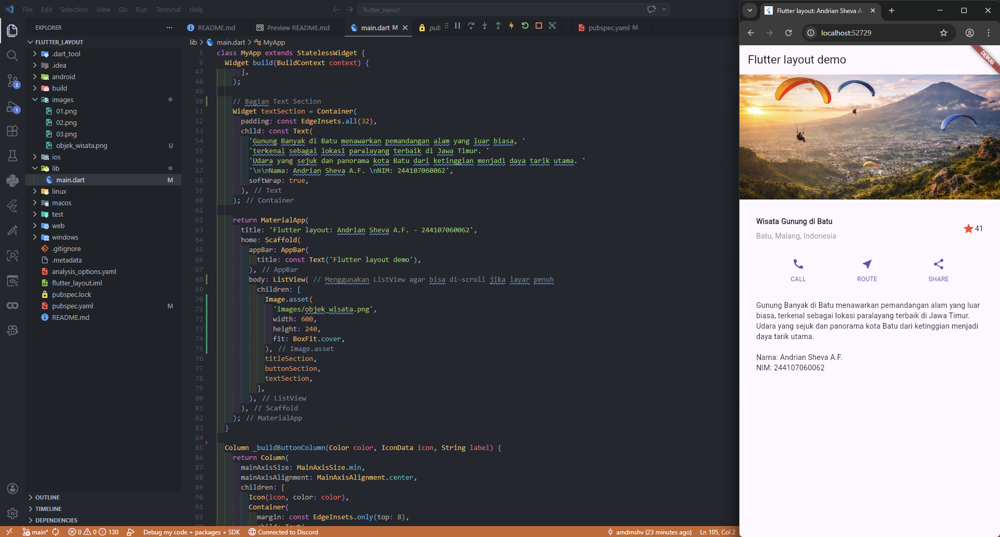

# flutter_layout

A new Flutter project.

## Praktikum 1: Membangun Layout di Flutter

- Widget Row & Column: Menyusun teks judul, lokasi, dan ikon rating secara vertikal maupun horizontal.
- Expanded & Padding: Mengatur proporsi ruang teks agar ikon tetap di sisi kanan dan memberikan jarak antar elemen agar tampilan tidak rapat.
- Styling: Memberikan gaya visual seperti teks tebal pada judul, warna abu-abu pada sub-judul, dan warna merah pada ikon bintang.

## Praktikum 2: Implementasi button row

- buttonSection: Didefinisikan di bawah titleSection. Widget ini menggunakan MainAxisAlignment.spaceEvenly agar ketiga tombol (CALL, ROUTE, SHARE) memiliki jarak yang sejajar dan rapi
- Di dalam widget Column pada Scaffold, sekarang terdapat dua variabel yaitu titleSection dan buttonSection yang disusun secara vertikal.

## Praktikum 3: Implementasi text section

- textSection: Menggunakan Container dengan padding 32 agar teks tidak menyentuh pinggir layar.
- softWrap: true: Menjamin teks otomatis pindah ke baris baru saat mencapai batas lebar layar.
- body: Column: Menyusun titleSection, buttonSection, dan textSection secara berurutan dari atas ke bawah

## Praktikum 4: Implementasi image section

- Image.asset: Menampilkan gambar objek_wisata.png yang diambil dari folder lokal images sebagai header aplikasi.